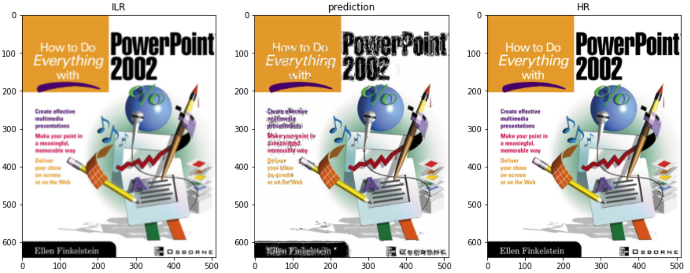

# RDN for SR by keras
 Residual Dense Network for Image Super-Resolution by keras

A reproduction of 'Residual Dense Network for Image Super-Resolution'
____________________________________________________________________________________
## Dependencies
Requires following packages:  
* python: 3.6.9  
* OpenCV: 4.1.2  
* tensorflow: 2.4.1  
* tqdm: 4.41.1  
* numpy: 1.19.5  
* matplotlib: 3.2.2  

## Introduction
The RDB number (D) , Conv number (C) per RDB, and growth rate (G) are 20, 6, 32. Since I build the model in subclass method, the number of D and C can not be changed, but the number of G can be set at the beginning. As the paper said it can process gray or color image, so the input and out channels can also be changed. Considering processing Y channel of Y_CrCb form is practicable in previous deep neural networks for SR task, so the model can process three kind of images in total. However, I've only tried color images and Y channel of Y_CrCb form. Due to limited time, I only trained scale x2, but this model could handle several scales by its Upscale module. I trained my model on Google Colaboratory. Limited by its RAM, I choose BDSD100, T91, General 100 instead of DIV2K dataset. 

## Usage
### model.py
I used Keras to implement this model.The model is built by subclass method. Input size, scale for Upscale module, number of image channels and growth rate are able to be set. Plus, since there only have MAE in keras, so I define L1 loss by myself.
### data_processing.py
Functions for reading images and pre-processing them.
#### 1. delcrust()
In order to generate low-resolution images, edges that cannot be divisible by scale of high-resolution images have to be cut down.
#### 2. splitdata()
Split images into small parts, and arrange them into numpy array.
#### 3. dataaug()
Data augmentation, including rotations and flippings.
#### 4. get_train_data()
Using delcrust() and splitdata() functions to process training data. The file address should be folders.
#### 5. get_test_data()
Using delcrust() and splitdata() functions to process testing data. The file address should be an image.
#### 6. imgappend()
Restore numpy array to image to show final result.
#### 7. psnr()
As the paper said, psnr is calculated on Y channel of transformed YCbCr space.
### train_RDN.py
Get training data, build the model and then train it. The model will be saved after training. Because the model is built by subclass method, it can't be saved by model.save(). Instead, I choose to save its weights only.
### test.py
Get testing data, load trained model and evaluate its ability. Finally, show the LR image, predicted image, HR image and calculate PSNR.
### RDN.ipynb
The ipynb file that I used on Google Colaboratory.
## Result
I've trained two models for RGB and Y_CrCb form respectively.  
Butterfly from Set5:  
(1) RGB  

(2) Y_CrCb  
\
Flowers from Set14:  
(1) RGB  

(2) Y_CrCb  

  
  
Although two models got good results while processing the majority of testing images, some images can't be predict successfully.
Zebra from Set14:  
(1) RGB  

(2) Y_CrCb  

Ppt3 from Set14:  
(1) RGB  

(2) Y_CrCb  

I believe this problem can be sloved with big dataset like DIV2K dataset. I would have a try if I have a stable GPU in the future.  
What's more, it is obviously that the model trained by Y channel of Y_CrCb space is more robust. Plus, considering it has less variables to train, RDN could perform better with Y channel instead of RGB images.
## Thanks to:
https://github.com/atriumlts/subpixel. Atriumlts realized subpixel layer by Keras.  
https://github.com/rajatkb/RDNSR-Residual-Dense-Network-for-Super-Resolution-Keras. Rajatkb refined Atriumlts' subpixel layer, made it work. I noticed Rajatkb's RDN has some differences between the paper proposed, but its results are still great. It inspired me to made some minor changes while building the model.
